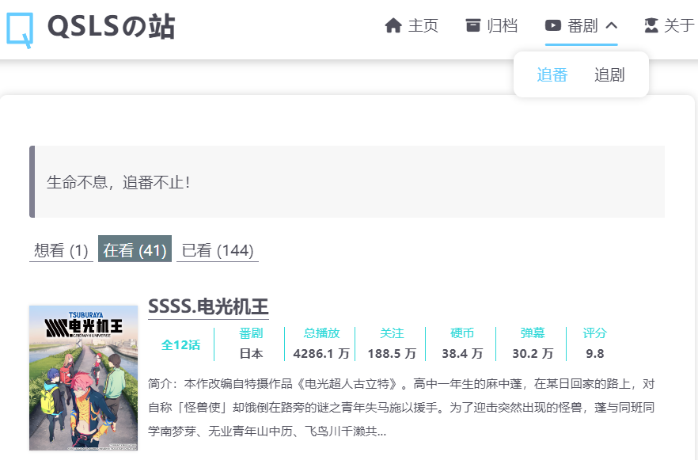

<h1>本站此插件有冲突无法使用😅待修复...</h1>


### 安装hexo-bilibili-bangumi插件

Github[hexo- bilibili- bangumi](https://github.com/HCLonely/hexo-bilibili-bangumi)

```powershell
npm install hexo-bilibili-bangumi --save
```

### 配置

将以下信息写入hexo配置文件`_config.yml`中，
```yml
bangumi: # 追番设置
  enable: true
  source: bili
  bgmInfoSource: 'bgmv0'
  path:
  vmid:
  title: '追番列表'
  quote: '生命不息，追番不止！'
  show: 1
  lazyload: true
  srcValue: '__image__'
  lazyloadAttrName: 'data-src=__image__'
  loading:
  showMyComment: false
  pagination: false
  metaColor:
  color:
  webp:
  progress:
  progressBar:
  extraOrder:
  order: latest
  proxy:
    host: '代理host'
    port: '代理端口'
  extra_options:
    key: value
  coverMirror:
cinema: # 追剧设置
  enable: true
  path:
  vmid:
  title: '追剧列表'
  quote: '生命不息，追剧不止！'
  show: 1
  lazyload: true
  srcValue: '__image__'
  lazyloadAttrName: 'data-src=__image__'
  loading:
  metaColor:
  color:
  webp:
  progress:
  progressBar:
  extraOrder:
  order:
  extra_options:
    key: value
  coverMirror:
game: # 游戏设置，仅支持source: bgmv0
  enable: true
  path:
  source: bgmv0
  vmid:
  title: '游戏列表'
  quote: '生命不息，游戏不止！'
  show: 1
  lazyload: true
  srcValue: '__image__'
  lazyloadAttrName: 'data-src=__image__'
  loading:
  metaColor:
  color:
  webp:
  progress:
  progressBar:
  extraOrder:
  order:
  extra_options:
    key: value
  coverMirror:
```
> 具体配置信息参考 [GitHub](https://github.com/HCLonely/hexo-bilibili-bangumi)

### 创建页面
番
```powershell
hexo new page bangumis
```
剧
```powershell
hexo new page cinemans
```
在主题文件配置中添加

```YML
menu: 
    ...
     番剧: 
      icon: fa-brands fa-youtube
      children:
           - 追番: /bangumis
           - 追剧: /cinemas
```
### 加载数据
运行部署前需加载一次番剧数据。
```powershell
hexo bangumi -u && hexo cinema -u && hexo clean && hexo g -d
```
部署运行后查看是否有追番追剧列表。<br>
样式参考



> [我的追番](https://blog.qingshanls.icu/bangumis)​ 
