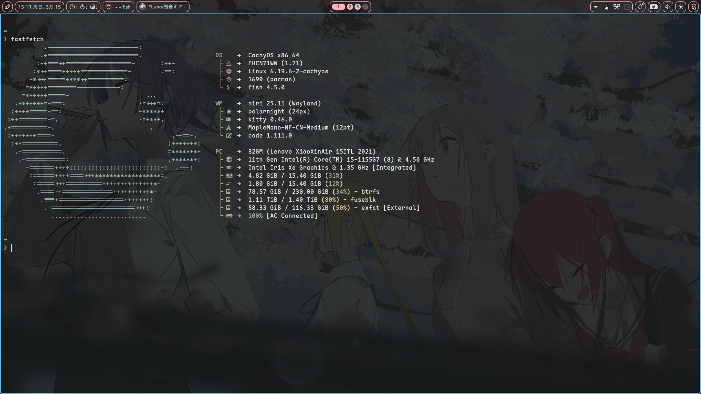
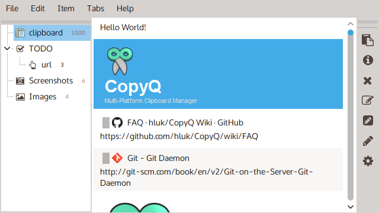
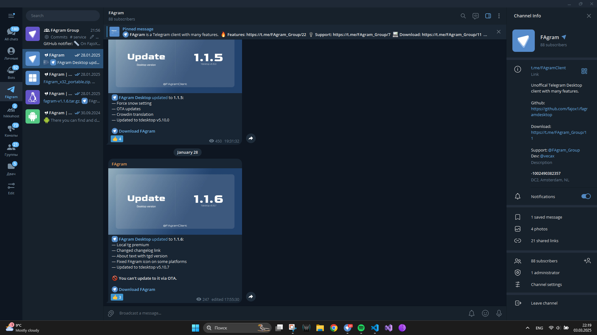
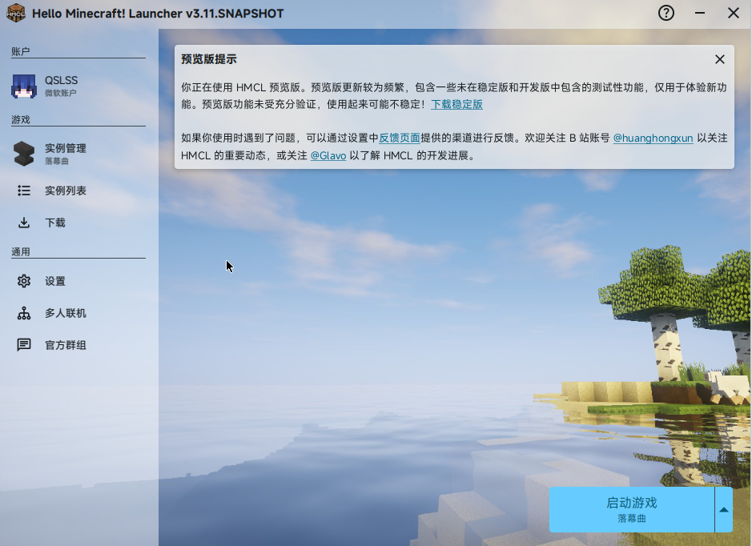
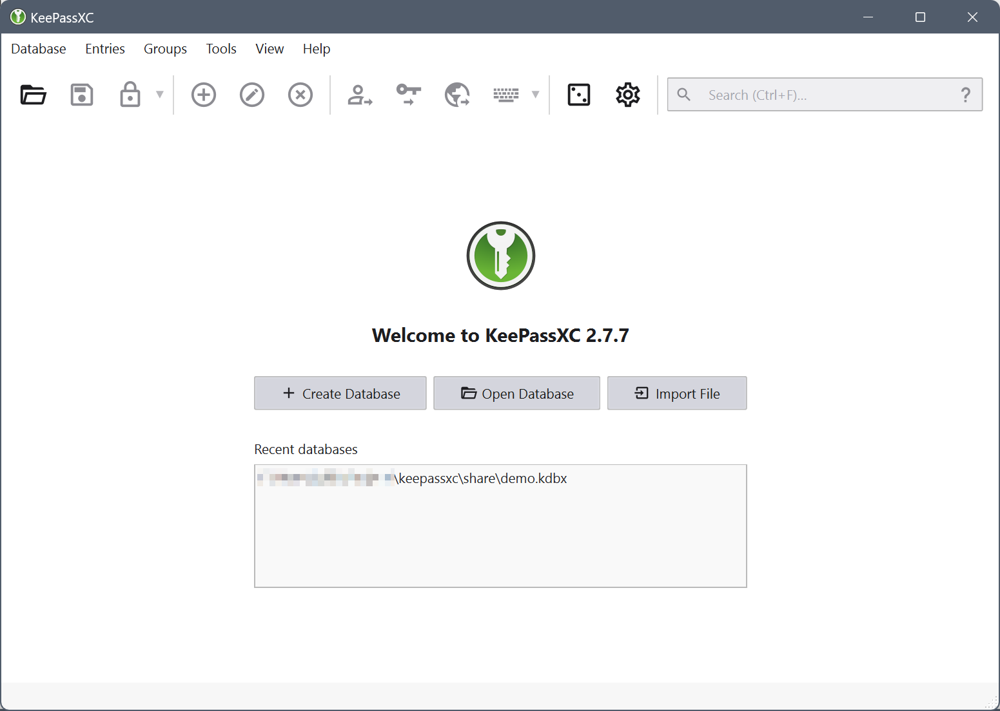
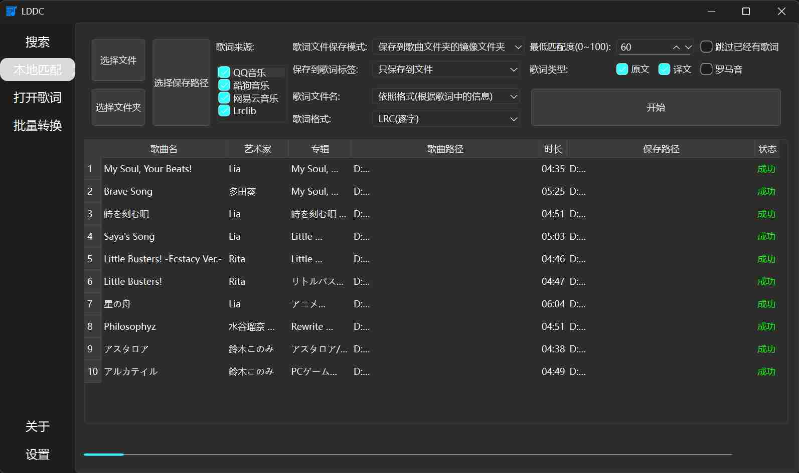

使用的 cachyos


### Splayer
一个简约的跨平台音乐播放器，支持逐字歌词、桌面歌词、任务栏歌词、云盘音乐、本地音乐管理及流媒体播放。

开源地址 [github](https://github.com/imsyy/SPlayer)
AUR安装：
```bash
paru -S splayer
```

### QQ、微信
AUR安装：
```bash
paru -S linuxqq wechat
```

### copyq
剪切板软件
https://github.com/hluk/CopyQ



安装方式：
```bash
sudo pacman -S copyq
```

### fagram
一个第三方的telegram客户端

```bash
paru -S fagram-bin 
```

### firefox-nightly
火狐nightly版本
```bash
sudo pacman -S firefox-nightly-zh-cn
```

### gearlever
管理appimage格式安装包的软件
https://gearlever.mijorus.it/


```bash
paru -S gearlever
```

### HMCL
一款好用的Minecraft启动器
https://hmcl.huangyuhui.net/



```bash
sudo pacman -S hmcl
```

### keepassxc
密码管理器

```bash
sudo pacman -S keepassxc
```

### LDDC
简单易用的精准歌词下载匹配工具
GitHub: https://github.com/chenmozhijin/LDDC

```bash
paru -S lddc-bin
```

### qview
简洁的看图软件
https://interversehq.com/qview
```bash
paru -S qview
```

### steam
steam在arch的multilib源有包
```bash
sudo  pacman -S steam
```

